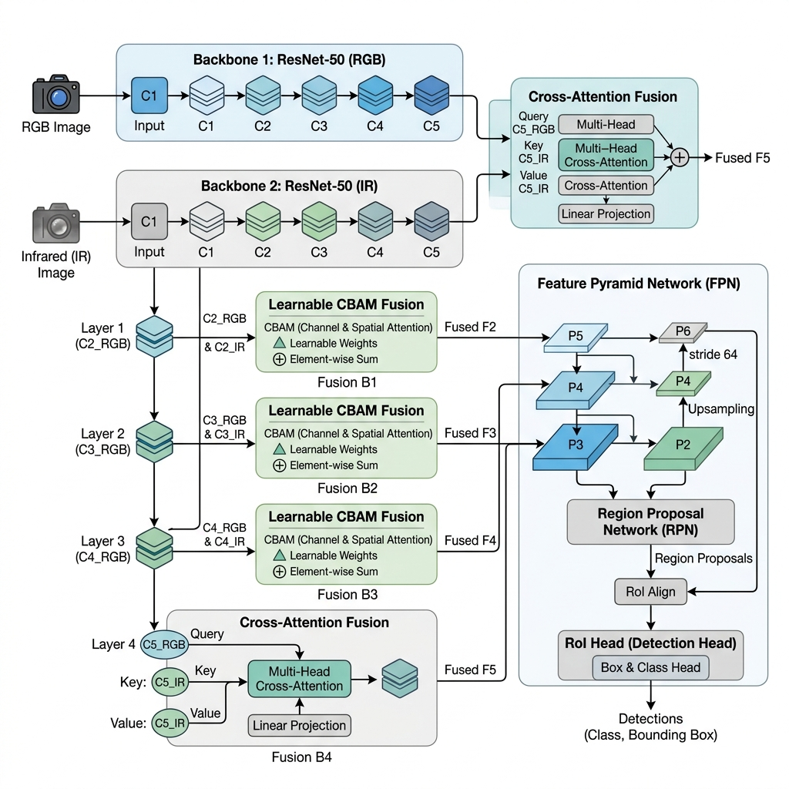

# Multimodal Faster R-CNN with Learnable CBAM & Cross-Attention Fusion

A dual-stream Faster R-CNN for **RGB–Thermal (RGBT)** object detection, using Detectron2 COCO-pretrained backbones with multi-level attention fusion. This architecture surpasses the **CSAA (CVPRW 2023)** paper benchmarks on both the **FLIR Aligned** and **LLVIP** datasets.

> **Paper reference:** *"Multimodal Object Detection by Channel Switching and Spatial Attention"* — Cao et al., CVPRW 2023

---

## Results

### FLIR Aligned Dataset

| Metric | Paper (CSAA) | Ours | Δ |
|:---|:---:|:---:|:---:|
| **mAP@0.5:0.95** | 41.30 | **42.85** | **+1.55** |
| **AP50** | 79.20 | **83.32** | **+4.12** |
| **AP75** | 37.40 | **57.40** | **+20.00** |

### LLVIP Dataset

| Metric | Paper (CSAA) | Ours | Δ |
|:---|:---:|:---:|:---:|
| **mAP@0.5:0.95** | 60.80 | **62.46** | **+1.66** |
| **AP50** | 96.50 | **96.82** | **+0.32** |
| **AP75** | 71.30 | **72.65** | **+1.35** |

---

## Architecture

<p align="center">
  
</p>

### Design Overview

```
RGB Image (3ch) ──► RGB Stem ──► Layer1 ──► Layer2 ──► Layer3 ──► Layer4
                                  │           │           │           │
                            CBAM Fusion  CBAM Fusion  CBAM Fusion  Cross-Attn
                                  │           │           │     Fusion │
IR Image (1ch) ───► IR Stem ──► Layer1 ──► Layer2 ──► Layer3 ──► Layer4
                                  │           │           │           │
                                  └───────────┴───────────┴───────────┘
                                                  │
                                          Feature Pyramid Network
                                                  │
                                     ┌────────────┴────────────┐
                                     │                         │
                              RPN (Focal Loss)          RoI Align + Head
                                                    (CE + DIoU Box Loss)
```

### Key Components

| Component | Description |
|:---|:---|
| **Dual-Stream Backbone** | Two independent ResNet-50 networks initialized with Detectron2 COCO-pretrained weights |
| **IR Stem** | Dedicated 1-channel input stem (initialized from mean of RGB conv1 weights) |
| **Learnable CBAM Fusion (C1–C3)** | α-weighted blend → Channel Attention → Spatial Attention → 1×1 conv |
| **Cross-Attention Fusion (C4)** | Multi-head attention (RGB queries IR) → LayerNorm → CBAM → 1×1 conv |
| **RPN Loss** | Focal Loss for objectness (handles foreground-background imbalance) |
| **Box Regression Loss** | DIoU Loss on decoded boxes (better localization than smooth-L1) |

### Key Differences from the CSAA Paper

| Feature | Paper (CSAA) | Ours |
|:---|:---|:---|
| Backbone init | ImageNet classification | **Detectron2 COCO detection** |
| Fusion | Channel Switching + Spatial Attn | **Learnable CBAM + Cross-Attention** |
| Box loss | Smooth-L1 | **DIoU** (better localization) |
| RPN loss | Binary Cross-Entropy | **Focal Loss** (handles imbalance) |
| IR input | 3-channel (repeated grayscale) | **1-channel** (dedicated stem) |

### Parameter Count

| Component | Paper (CSAA) | Ours | Δ |
|:---|---:|---:|---:|
| RGB + IR ResNet-50 Backbones | 47.0M | 47.0M | 0 |
| FPN + RPN + Box Head | 19.9M | 19.9M | 0 |
| Fusion Modules | ~1.5M | ~3.8M | +2.3M |
| **Total** | **~64.4M** | **~66.7M** | **+3.6%** |

---

## Installation

```bash
git clone https://github.com/Mitalimehta02/multimodal-faster-rcnn.git
cd multimodal-faster-rcnn
pip install -r requirements.txt
```

### Requirements
- Python 3.8+
- PyTorch ≥ 1.13
- CUDA-capable GPU (training was done on NVIDIA A100)

---

## Dataset Setup

### FLIR Aligned
Download the [FLIR Aligned Dataset](https://www.flir.com/oem/adas/adas-dataset-form/) and organize as:
```
/path/to/FLIR_aligned/
├── JPEGImages/
│   ├── FLIR_00001_RGB.jpg
│   └── FLIR_00001_PreviewData.jpeg
├── Annotations/
│   └── FLIR_00001_PreviewData.xml
├── align_train.txt
└── align_validation.txt
```

### LLVIP
Download the [LLVIP Dataset](https://bupt-ai-cz.github.io/LLVIP/) and organize as:
```
/path/to/LLVIP/
├── visible/
│   ├── train/
│   └── test/
├── infrared/
│   ├── train/
│   └── test/
└── Annotations/
```

Update the `root` path in the corresponding config file (`config/flir.yaml` or `config/llvip.yaml`).

---

## Training

```bash
# FLIR Aligned (4 classes: person, car, bicycle)
python tools/train.py --config config/flir.yaml --gpu 0

# LLVIP (1 class: person)
python tools/train.py --config config/llvip.yaml --gpu 0

# With mixed precision
python tools/train.py --config config/flir.yaml --gpu 0 --amp
```

### Training Recipe

| Setting | Value |
|:---|:---|
| Optimizer | AdamW |
| Base LR | 2.5×10⁻⁴ |
| Weight decay | 5×10⁻⁵ |
| Effective batch size | 16 (4 × 4 grad accum) |
| Epochs | 15 |
| LR schedule | Cosine annealing with 2-epoch linear warmup |
| Backbone freeze | First 3 epochs (preserves COCO features) |

### Differential Learning Rates
| Parameter Group | Learning Rate |
|:---|:---:|
| Backbone low (stem, layer1–2) | base_lr × 0.1 |
| Backbone high (layer3–4) | base_lr × 0.2 |
| Fusion + FPN + RPN + Head | base_lr × 1.0 |

---

## Evaluation

### Standard Evaluation
Evaluation runs automatically at the end of every training epoch.

### Test-Time Augmentation (TTA)
```bash
python tools/evaluate_tta.py \
    --config config/flir.yaml \
    --checkpoint outputs/flir_v9/checkpoints/best_model.pth \
    --scales 0.90 1.00 1.10 \
    --hflip
```

---

## Project Structure

```
multimodal-faster-rcnn/
├── model/
│   └── faster_rcnn.py          # Full model: backbone, fusion, FPN, RPN, RoI head
├── config/
│   ├── flir.yaml               # FLIR Aligned training config
│   └── llvip.yaml              # LLVIP training config
├── dataset/
│   ├── flir_aligned.py         # FLIR Aligned dataset loader
│   └── voc.py                  # LLVIP (VOC-format) dataset loader
├── tools/
│   ├── train.py                # Training script
│   └── evaluate_tta.py         # Test-Time Augmentation evaluation
├── utils/
│   ├── coco_detection_metrics.py   # COCO-style mAP computation
│   ├── metrics.py              # Metrics tracker + CSV logging
│   ├── logger.py               # Dual console + file logger
│   ├── seed_utils.py           # Reproducibility helpers
│   └── visualizer.py           # Detection visualization
├── assets/
│   └── architecture.png        # Architecture diagram
├── requirements.txt
└── README.md
```

---

## Training Progression

### FLIR Aligned

| Epoch | Loss | mAP | AP50 | AP75 |
|:---:|:---:|:---:|:---:|:---:|
| 1 | 0.3134 | 10.29 | 28.70 | 24.64 |
| 3* | 0.2721 | 32.97 | 74.20 | 33.94 |
| 5 | 0.2211 | 38.76 | 79.16 | 55.60 |
| 10 | 0.1802 | **42.26** | 82.62 | 52.64 |
| 12 | 0.1681 | 42.19 | **82.83** | **57.18** |

*\*Epoch 3: backbone unfrozen — massive jump in all metrics*

### LLVIP

| Epoch | Loss | mAP | AP50 | AP75 |
|:---:|:---:|:---:|:---:|:---:|
| 3 | 0.0879 | 57.03 | 96.12 | 64.30 |
| 8 | 0.0636 | 61.69 | 96.59 | **79.67** |
| 10 | 0.0620 | 62.09 | **96.87** | 69.58 |
| 13 | — | **62.46** | 96.82 | 72.65 |

---

## Hardware

Training was conducted on an **NVIDIA DGX system** with A100 GPUs.

---

## License

This project is for academic and research purposes.

---

## Acknowledgements

- [Detectron2](https://github.com/facebookresearch/detectron2) for COCO-pretrained backbone weights
- [FLIR ADAS Dataset](https://www.flir.com/oem/adas/adas-dataset-form/) for the FLIR Aligned benchmark
- [LLVIP Dataset](https://bupt-ai-cz.github.io/LLVIP/) for the visible-infrared paired pedestrian benchmark
- Cao et al., *"Multimodal Object Detection by Channel Switching and Spatial Attention"*, CVPRW 2023 — baseline reference
